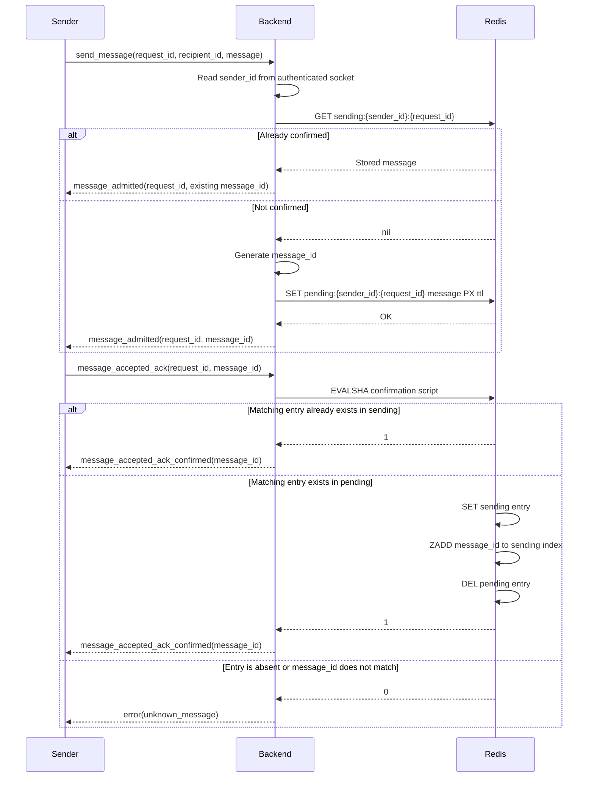

# Message admission

The current implementation covers only message admission and confirmation by the sender. It does not yet deliver messages to recipients or persist offline messages in PostgreSQL.

## Protocol



## Redis data

### Pending entry

Key:

```text
chatchat:{admission}:pending:<sender_id>:<base64url(request_id)>
```

Value:

```json
{
  "message_id": "server-generated UUID",
  "sender_id": 1,
  "request_id": "client-generated ID",
  "recipient_id": 2,
  "message": "payload"
}
```

The pending entry has the configured `pending_ttl`. Sending the same request ID again before confirmation replaces the pending value and receives a new message ID.

### Sending entry

Key:

```text
chatchat:{admission}:sending:<sender_id>:<base64url(request_id)>
```

The value is copied unchanged from the pending entry. It currently has no expiration.

### Sending index

Key:

```text
chatchat:{admission}:sending
```

This is a sorted set containing message IDs. Its score is the server timestamp in milliseconds at confirmation time.

The `{admission}` hash tag keeps all keys used by the Lua script in one Redis Cluster slot.

## Atomic confirmation

`confirm_message_id_attribution.lua` performs the confirmation atomically:

1. If the sending entry already contains the supplied message ID, return success. This makes repeated acknowledgements idempotent.
2. Otherwise, require a pending entry containing that message ID.
3. Copy pending to sending, add the message ID to the sending index, and delete pending.
4. Return failure when the entry is missing, expired, replaced, or has a different message ID.

The backend loads the script at startup and normally calls it with `EVALSHA`. If Redis has discarded its script cache, the backend handles `NOSCRIPT` by loading the script and retrying once.

Calls go directly through the shared Redix connection rather than through the `MessageAdmission` GenServer, so confirmations are not serialized by one BE process.

## Current retry behavior

- If the sender does not receive `message_admitted`, it may send the message again with the same request ID. While the entry is pending, this replaces it and produces a new message ID.
- If the sender does not receive `message_accepted_ack_confirmed`, it may repeat the acknowledgement with the same request ID and message ID.
- If confirmation returns `unknown_message`, the pending entry either expired, was replaced, or does not match. The sender must submit the message again.

## Not implemented

- Forwarding confirmed messages to online recipients.
- Recipient delivery acknowledgements.
- Moving undelivered messages to PostgreSQL.
- Replaying stored messages when a recipient reconnects.
- Reporting delivered or queued status to the sender.
- Removing completed entries from the sending table and index.
