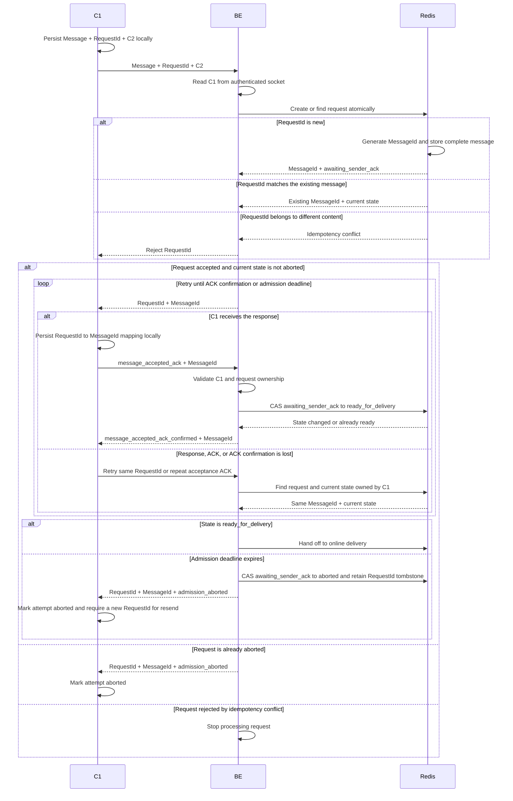
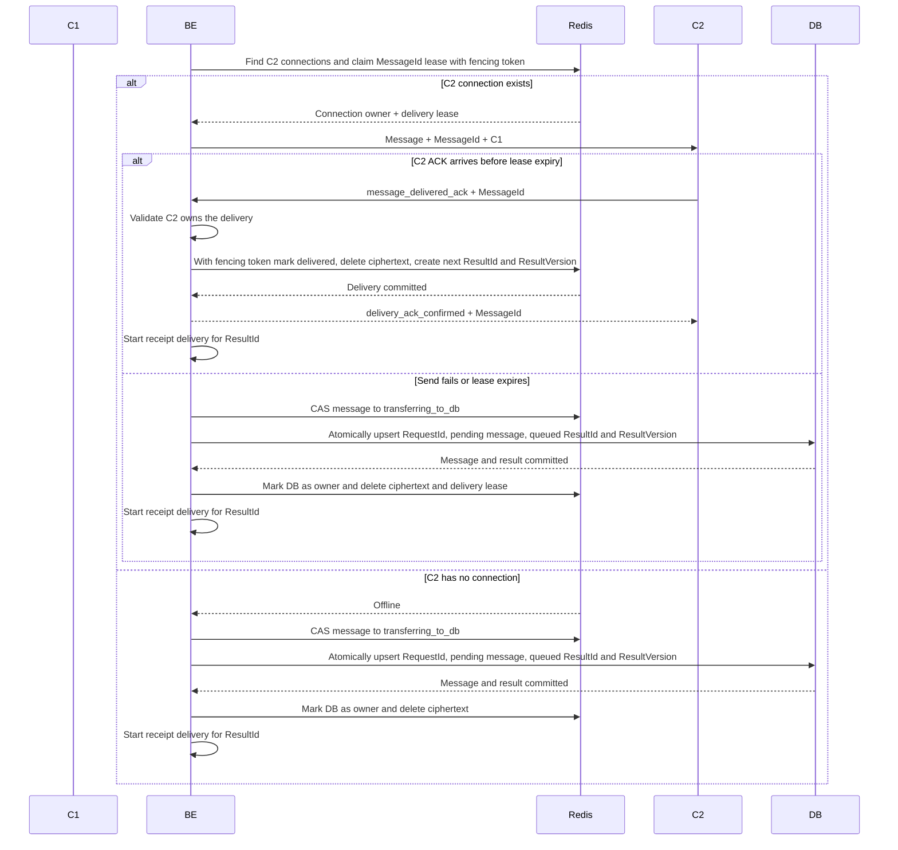
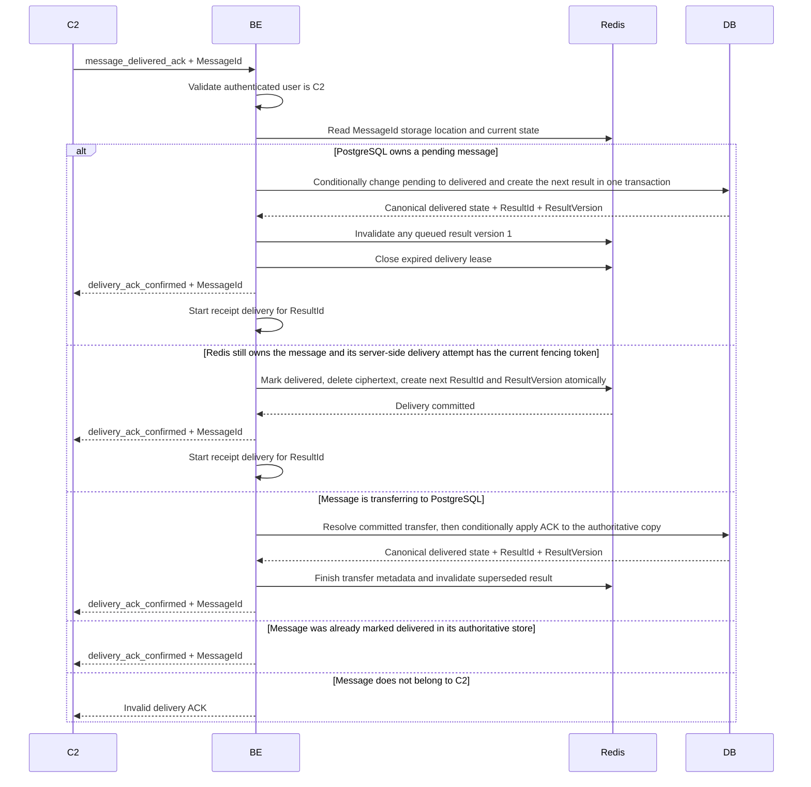
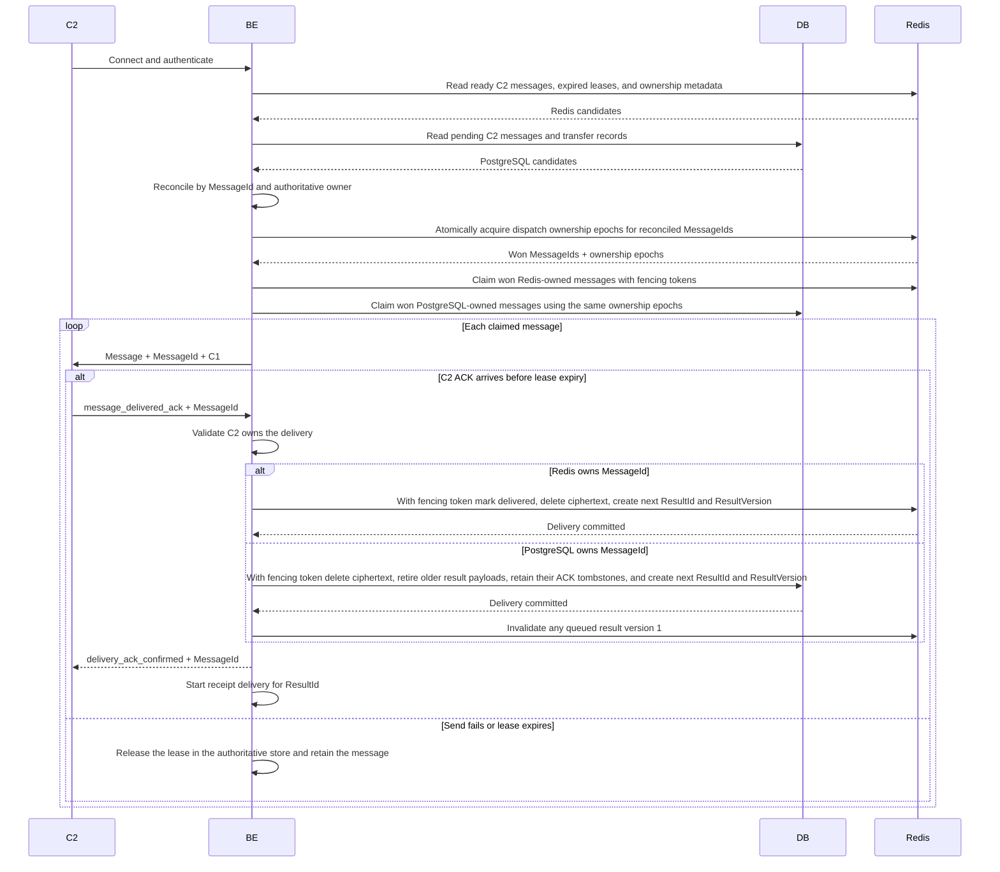
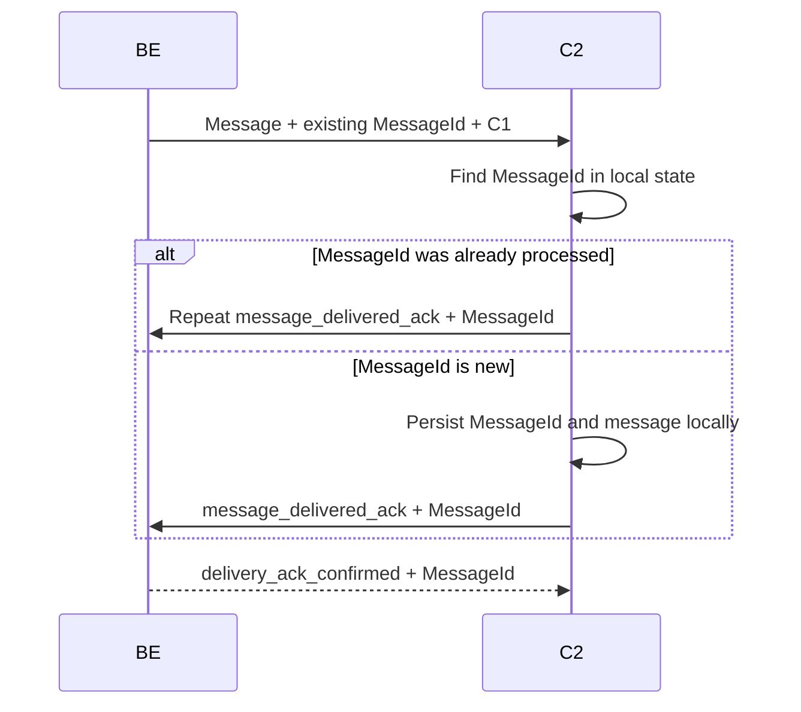
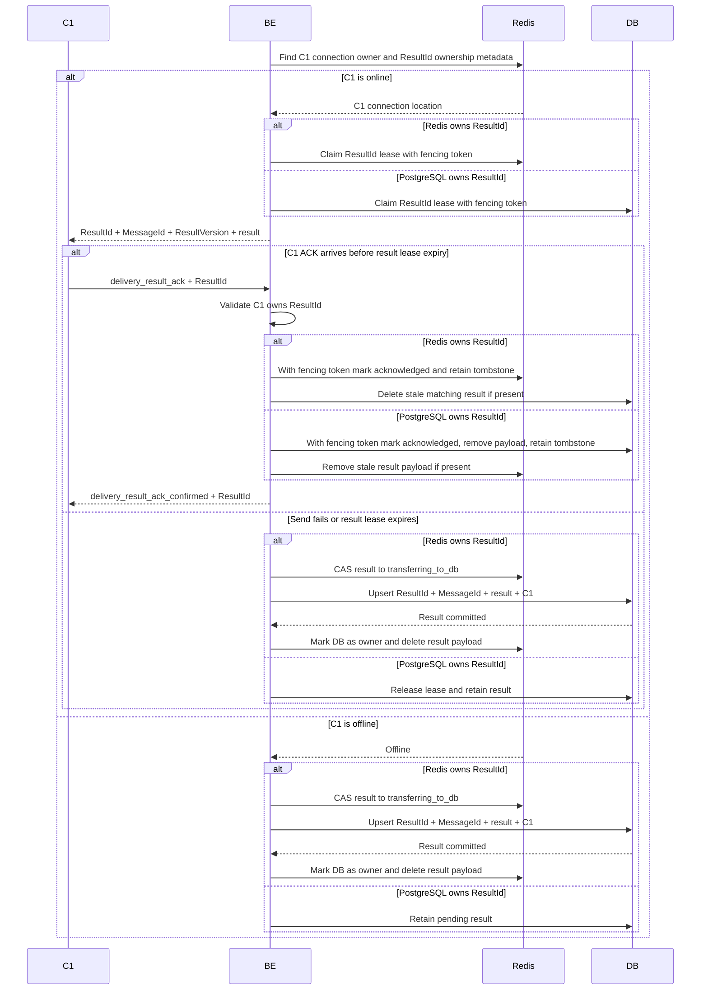
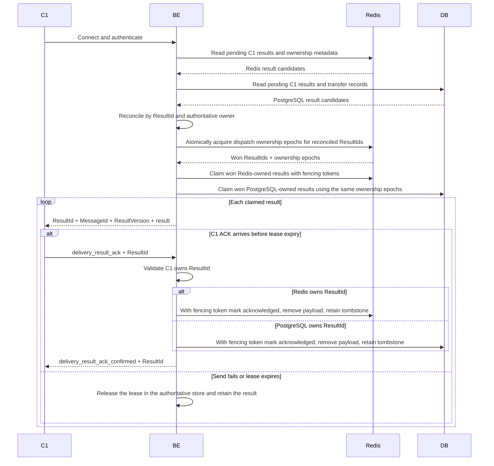
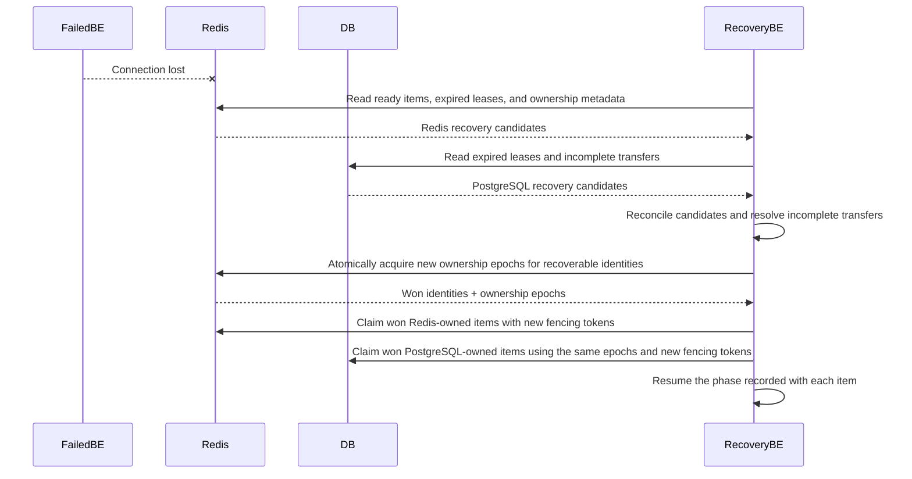
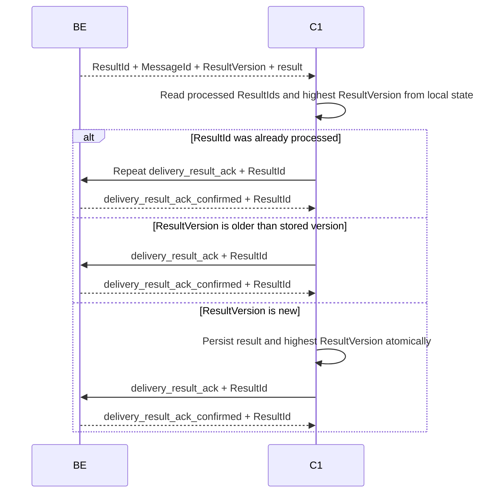

# Message delivery sequence

## 1. Message admission and sender confirmation

## 2. Immediate delivery to an online recipient

## 3. Late recipient ACK after database fallback

## 4. Delivery of messages stored for an offline recipient

## 5. Duplicate delivery after a lost recipient ACK

## 6. Delivery result to the sender

`ResultId` identifies a specific result transition. The first result has version 1. A queued
message may later produce a delivered result with the next version.

## 7. Delivery of stored results when the sender reconnects

## 8. Backend crash recovery

## 9. Duplicate or reordered delivery results

## Required identities

- `(C1, RequestId)` identifies one send attempt and is used only for admission retries.
- `MessageId` is generated by the backend and identifies the message through every delivery attempt.
- `ResultId` identifies one delivery-state notification, preventing a delayed `not_delivered` ACK from deleting a later `delivered` result.
- `ResultVersion` is monotonic per message. C1 ignores results older than the highest version it has already applied.
- Creating a newer result retires delivery of older result payloads but preserves every older ResultId as an ACKable tombstone. An ACK already in flight therefore still receives confirmation and cannot affect the newer result.
- Redis creation of a new request must atomically generate `MessageId`, store the complete message, and create the idempotency mapping.
- PostgreSQL operations use unique `MessageId`, `ResultId`, `(MessageId, ResultVersion)`, and `(C1, RequestId)` constraints so retries cannot create logical duplicates.
- An aborted `(C1, RequestId)` remains as a tombstone for at least as long as C1 may durably retry it. Reusing it cannot create a new message.
- Removing ciphertext never removes the idempotency record. Retries still return the same `MessageId` and terminal state.
- C1 persists processed `ResultId` and highest `ResultVersion` values before ACKing, so duplicated or reordered results are harmless.
- C1 persists the outgoing message before its first send and persists the `RequestId` to `MessageId` mapping before sending `message_accepted_ack`. A client restart can therefore resume admission without creating a new request.
- C1 does not consider admission complete until it receives `message_accepted_ack_confirmed`. Repeating either the original request or its acceptance ACK is idempotent.
- An `admission_aborted` response is terminal for that RequestId. C1 retains the tombstoned attempt for reconciliation and uses a new RequestId only for an explicit resend.
- After PostgreSQL commits a fallback, the Redis idempotency record points to PostgreSQL. Late ACK handling reads that location and uses PostgreSQL as the authoritative state.
- If the Redis location pointer is missing, BE resolves a retried `(C1, RequestId)` against PostgreSQL before creating a new message.
- If ResultId ownership metadata is missing or transitional, BE resolves the ResultId against PostgreSQL before claiming, acknowledging, or recreating the result.
- ACK handlers tolerate a temporary copy in both Redis and PostgreSQL. They update the authoritative state first and clean up the stale copy afterward.
- `ResultVersion` allocation is performed by whichever store currently owns the authoritative message state. A Redis-to-DB handoff persists the last allocated version in the same database transaction.
- A message-state transition atomically stores the generated ResultId and ResultVersion with the new state. Retrying that transition returns the stored result identity instead of allocating another result.
- The PostgreSQL `pending` to `delivered` change is a conditional transition, not a read followed by an update. Exactly one transaction creates the delivered result; concurrent or late ACK transactions read and return that canonical ResultId and ResultVersion.
- Acceptance and admission expiry use one atomic compare-and-set. Expiry may abort only `awaiting_sender_ack`; it cannot delete a message already ready for delivery.
- Every delivery lease has a monotonically increasing fencing token. A worker may change state only while its token is current, preventing an expired worker from overwriting its replacement.
- Fencing tokens are server-side state. Client ACKs contain only public identifiers; BE resolves the delivery attempt and token from the authenticated connection and rejects ACKs not associated with an attempt sent on that connection.
- Delivery-result leases also use fencing tokens. An expired receipt sender cannot recreate a DB result after C1 has already acknowledged it.
- Message transitions are monotonic. A PostgreSQL upsert may create or retain `pending`, but cannot change `delivered` back to `pending` during reconciliation.
- Terminal message metadata remains after ciphertext deletion for at least as long as C2 may durably retry an ACK or C1 may durably retry the request.
- Moving a message or result from Redis to PostgreSQL first changes its Redis state to `transferring_to_db`. ACK processing follows that state to the authoritative store instead of racing the transfer.
- Reconnect scans reconcile Redis and PostgreSQL candidates by identity before claiming them. A `MessageId` or `ResultId` may have only one authoritative lease, even while both stores temporarily contain payload copies.
- Reconciliation reads are not sufficient for exclusion. Before either store grants a delivery lease, BE must win one Redis-coordinated ownership epoch for that identity; PostgreSQL records that epoch with its lease and rejects work carrying an older epoch. Items in `transferring_to_db` are not dispatchable until ownership is resolved.
- Crash recovery follows the same ownership-epoch protocol as normal dispatch. Expired leases do not authorize independent PostgreSQL claims.
- Acknowledged ResultIds retain tombstones for at least as long as C1 may durably retry the ACK, as well as longer than every delivery and recovery lease. A delayed timeout cannot recreate an already acknowledged result.
- Retry retention is a protocol contract, not only a server cache policy. If clients may retry durable records without a time limit, the corresponding RequestId, MessageId, and ResultId tombstones cannot expire; bounded retention requires a client-visible retry deadline and client enforcement.
- When C2 authenticates, BE checks both Redis and PostgreSQL because Redis may contain accepted messages that were never transferred to PostgreSQL.
- BE does not acknowledge a new request unless Redis confirms the atomic message and idempotency write.
- C1 repeats `delivery_result_ack` until it receives `delivery_result_ack_confirmed`. BE answers repeated ACKs from the ResultId tombstone.
- A Redis-to-PostgreSQL transfer is recoverable when BE crashes after the DB commit but before updating Redis: `transferring_to_db` resolution checks PostgreSQL before retrying or rolling back.
- If PostgreSQL is unavailable during fallback, Redis retains the complete message and retries the handoff. BE cannot emit `not_delivered` until PostgreSQL commits it.
- Redis acknowledgement of a new message requires the configured durability level, including replication confirmation when failover without acknowledged-write loss is required.
- `BE` represents the backend cluster. Delivery to a connection owned by another node is routed to that owner while Redis retains the pending item and lease until the client ACK arrives.
- Delivery order is not guaranteed by `MessageId`. If chat ordering is required, BE must also assign a monotonic sequence per conversation and deliver pending messages in that order.
- The protocol must define whether delivery to any C2 connection or every C2 connection constitutes delivery. The diagrams assume one claimed C2 connection and one valid ACK is sufficient.
