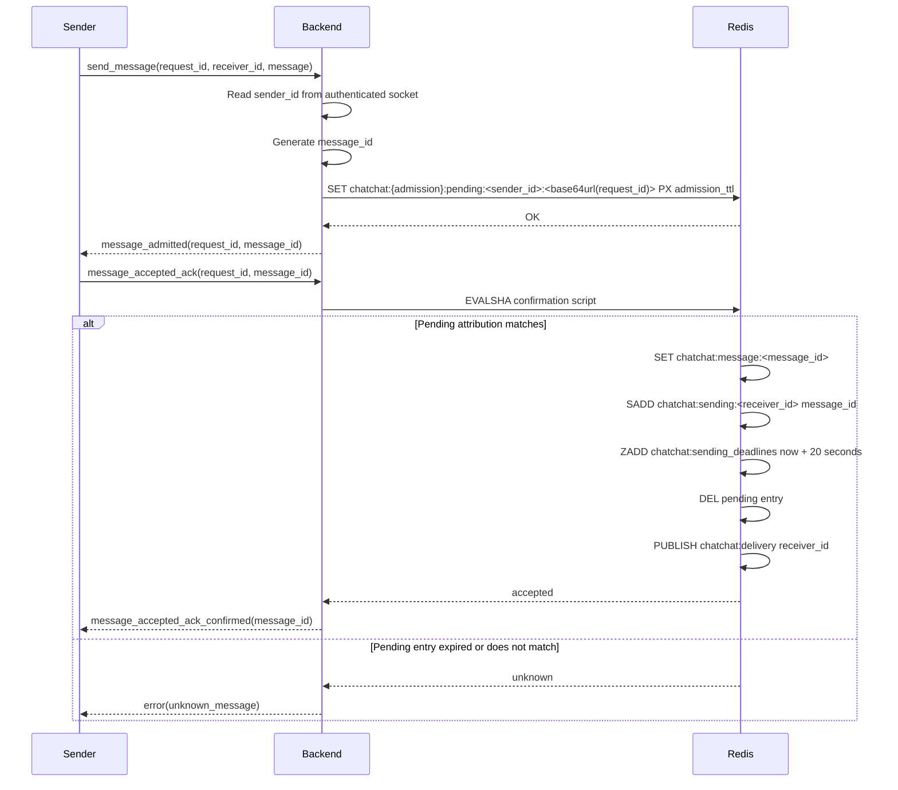
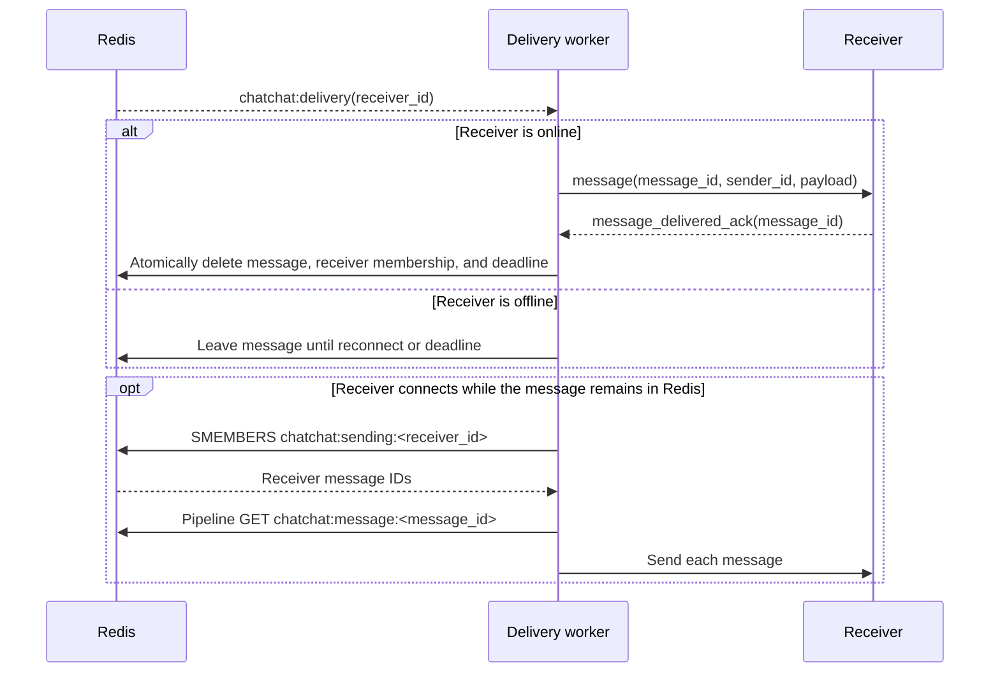
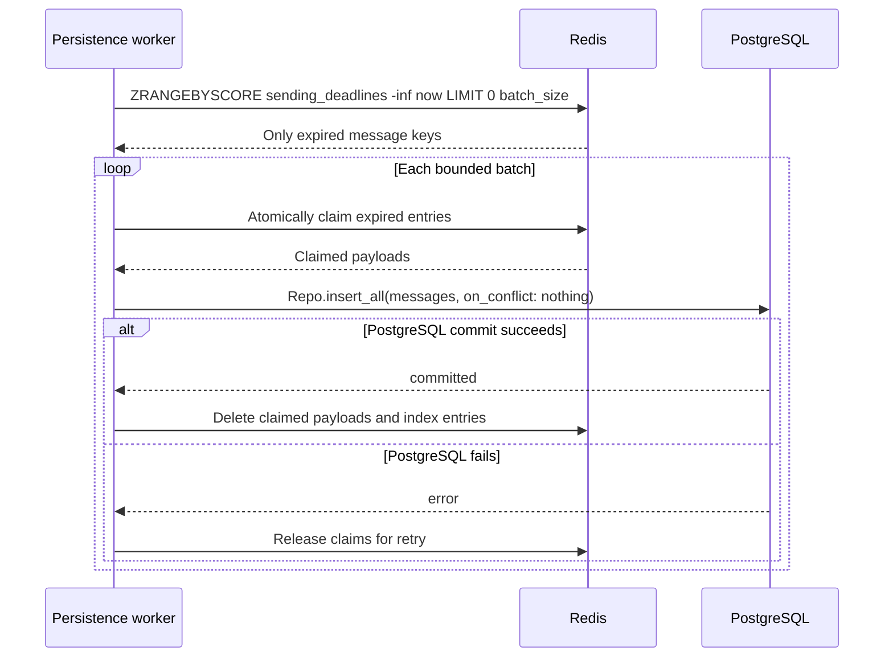

# Message delivery

Messages remain in Redis for a 20-second online-delivery window. Messages not acknowledged during that window are moved to PostgreSQL for future delivery.

## Message acceptance



The confirmation script creates these entries atomically:

```text
chatchat:message:<message_id>          -> complete admitted message
chatchat:sending:<receiver_id>         -> set of message_ids
chatchat:sending_deadlines             -> score: expires_at_ms, member: message_id
```

The pending entry remains keyed by `sender_id + request_id` because it identifies the sender's admission request. It is deleted when the message enters the sending state. Repeating the sender acknowledgement after that returns `unknown_message`.

The script is loaded at startup and called with `EVALSHA`. On `NOSCRIPT`, the backend loads it again and retries once.

## Delivery worker



The delivery worker subscribes to the Redis delivery channel. The same `wake(receiver_id)` path handles both Pub/Sub notifications and receiver authentication. It reads only that receiver's set and pipelines the corresponding message reads; it never scans the Redis keyspace.

The `message_id` is included in every delivery and acknowledgement. A successful acknowledgement sends no response to the client. It atomically removes the message, its receiver-set membership, and its deadline.

## Persistence worker



The worker never runs `SCAN`. The sorted set is the expiration index, so finding expired messages costs approximately `O(log N + batch_size)`.

Messages are handled in fixed-size batches:

1. Read expired members from `sending_deadlines`.
2. Atomically claim them so the delivery worker cannot start another delivery.
3. Fetch their payloads with a Redis pipeline.
4. Insert the batch with `Repo.insert_all/3`.
5. Use `message_id` as a PostgreSQL unique key and `on_conflict: :nothing`.
6. Remove Redis data only after PostgreSQL commits.

Claims must remain recoverable in Redis until the database commit. If the backend crashes, the persistence worker can reclaim stale claims. A recipient acknowledgement racing with persistence must be resolved idempotently against the claimed message.

When a query returns a full batch, the worker immediately requests another one. Otherwise, it reads the earliest deadline and schedules itself for that time instead of polling every second.

## PostgreSQL message

The stored record needs at least:

```text
message_id
sender_id
receiver_id
payload
inserted_at
```

`message_id` is unique. This makes retries safe if PostgreSQL commits but the backend crashes before cleaning Redis.
