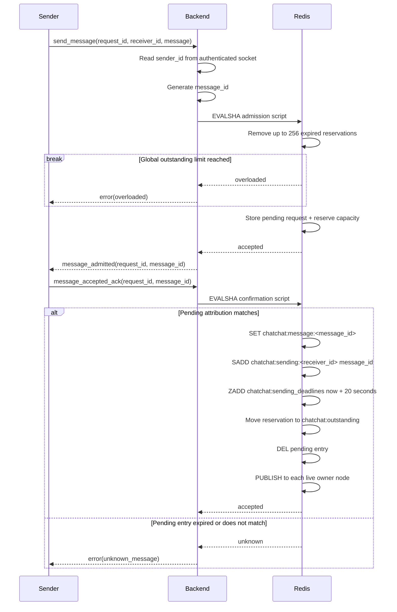
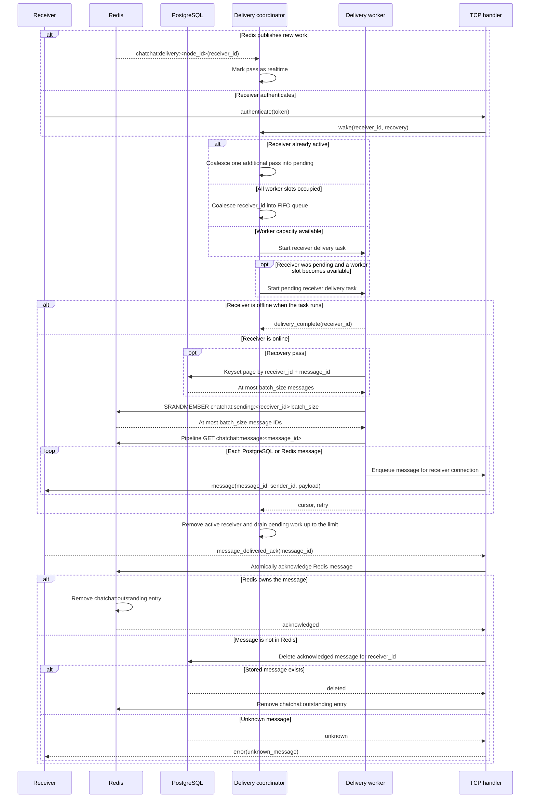

# Message delivery

Delivery is at least once. Messages remain in Redis for 20 seconds, then move to PostgreSQL if not
acknowledged. Consumers deduplicate by `message_id`.

## Message acceptance


```mermaid
sequenceDiagram
    participant C1 as Sender
    participant BE as Backend
    participant Redis

    C1->>BE: send_message(request_id, receiver_id, message)
    BE->>BE: Read sender_id from authenticated socket
    BE->>BE: Generate message_id
    BE->>Redis: EVALSHA admission script
    Redis->>Redis: Remove up to 256 expired reservations
    break Global outstanding limit reached
        Redis-->>BE: overloaded
        BE-->>C1: error(overloaded)
    end
    Redis->>Redis: Store pending request + reserve capacity
    Redis-->>BE: accepted
    BE-->>C1: message_admitted(request_id, message_id)

    C1->>BE: message_accepted_ack(request_id, message_id)
    BE->>Redis: EVALSHA confirmation script

    alt Pending attribution matches
        Redis->>Redis: SET chatchat:message:<message_id>
        Redis->>Redis: SADD chatchat:sending:<receiver_id> message_id
        Redis->>Redis: ZADD chatchat:sending_deadlines now + 20 seconds
        Redis->>Redis: Move reservation to chatchat:outstanding
        Redis->>Redis: DEL pending entry
        Redis->>Redis: PUBLISH to each live owner node
        Redis-->>BE: accepted
    else Pending entry expired or does not match
        Redis-->>BE: unknown
        BE-->>C1: error(unknown_message)
    end
```

The confirmation script creates these entries atomically:

```text
chatchat:message:<message_id>          -> complete admitted message
chatchat:{admission}:pending:<sender>:<request> -> unconfirmed request
chatchat:sending:<receiver_id>         -> set of message_ids
chatchat:sending_deadlines             -> score: expires_at_ms, member: message_id
chatchat:admission_reservations        -> unconfirmed requests consuming capacity
chatchat:outstanding                   -> confirmed messages consuming capacity
```

The limit counts reservations and confirmed messages across every TCP node. Expired reservations are
removed during admission. The pending entry is keyed by `sender_id + request_id`; confirmation
deletes it. Repeated confirmation returns `unknown_message`.

The confirmation script is preloaded at startup. Every script uses `EVALSHA`; `NOSCRIPT` loads and
retries it once.

## Delivery worker


```mermaid
sequenceDiagram
    participant C2 as Receiver
    participant Redis
    participant DB as PostgreSQL
    participant DC as Delivery coordinator
    participant DW as Delivery worker
    participant H as TCP handler

    alt Redis publishes new work
        Redis-->>DC: chatchat:delivery:<node_id>(receiver_id)
        DC->>DC: Mark pass as realtime
    else Receiver authenticates
        C2->>H: authenticate(token)
        H->>DC: wake(receiver_id, recovery)
    end

    alt Receiver already active
        DC->>DC: Coalesce one additional pass into pending
    else All worker slots occupied
        DC->>DC: Coalesce receiver_id into FIFO queue
    else Worker capacity available
        DC->>DW: Start receiver delivery task
    end

    opt Receiver was pending and a worker slot becomes available
        DC->>DW: Start pending receiver delivery task
    end

    alt Receiver is offline when the task runs
        DW-->>DC: delivery_complete(receiver_id)
    else Receiver is online
        opt Recovery pass
            DW->>DB: Keyset page by receiver_id + message_id
            DB-->>DW: At most batch_size messages
        end
        DW->>Redis: SRANDMEMBER chatchat:sending:<receiver_id> batch_size
        Redis-->>DW: At most batch_size message IDs
        DW->>Redis: Pipeline GET chatchat:message:<message_id>
        loop Each PostgreSQL or Redis message
            DW->>H: Enqueue message for receiver connection
            H->>C2: message(message_id, sender_id, payload)
        end
        DW-->>DC: cursor, retry
    end

    DC->>DC: Remove active receiver and drain pending work up to the limit

    C2-->>H: message_delivered_ack(message_id)
    H->>Redis: Atomically acknowledge Redis message
    alt Redis owns the message
        Redis->>Redis: Remove chatchat:outstanding entry
        Redis-->>H: acknowledged
    else Message is not in Redis
        H->>DB: Delete acknowledged message for receiver_id
        alt Stored message exists
            DB-->>H: deleted
            H->>Redis: Remove chatchat:outstanding entry
        else Unknown message
            DB-->>H: unknown
            H-->>C2: error(unknown_message)
        end
    end
```

`ChatchatTcp.Delivery` is node-local. It subscribes to that node's Redis channel; Pub/Sub and
authentication share `wake(receiver_id, kind)`.

`active` tracks running receivers. `pending` is FIFO and deduplicated; recovery upgrades realtime
work. Wakeups during an active pass become one rerun. Tasks are monitored: failure releases the slot
and schedules retry. Full PostgreSQL pages retain a cursor and requeue recovery. A non-empty Redis
batch schedules another realtime pass after one second, allowing ACKs to shrink the set first.

This bounds concurrent PostgreSQL queries and Redis pipelines during a burst. It deliberately trades some queueing latency for stable downstream resource usage. The current scheduler state is exposed as `chatchat_delivery_active_workers` and `chatchat_delivery_pending_receivers`.

Each pass reads bounded receiver-specific Redis and PostgreSQL pages. Admission, delivery, and
persistence use separate Redis connections to avoid client-side head-of-line blocking.

A successful ACK sends no response. Redis cleanup is atomic. Persisted ACK deletes PostgreSQL, then
releases Redis capacity. Without durable receipts, a crash between those two operations can leak one
capacity slot.

## Persistence worker

```mermaid
sequenceDiagram
    participant PW as Persistence worker
    participant Redis
    participant DB as PostgreSQL

    PW->>Redis: ZRANGEBYSCORE sending_deadlines -inf now LIMIT 0 batch_size
    Redis-->>PW: Expired message IDs

    loop Each bounded batch
        PW->>Redis: Atomically claim expired entries
        Redis->>Redis: Move message:<id> to persisting:<id>
        Redis->>Redis: Remove receiver membership and deadline
        Redis-->>PW: Claimed payloads
        PW->>DB: Repo.insert_all(messages, on_conflict: nothing)

        alt PostgreSQL commit succeeds
            DB-->>PW: committed
            PW->>Redis: Delete transient delivery keys; retain outstanding capacity
        else PostgreSQL fails
            DB-->>PW: error
            PW->>Redis: Retain claims for retry
        end
    end
```

Expired lookup uses the sorted-set index: `O(log N + batch_size)`. Recovery of interrupted claims
uses bounded `SSCAN` on the persisting set, never keyspace `SCAN`.

Messages are handled in fixed-size batches:

1. Read expired members from `sending_deadlines`.
2. Atomically move them out of the sending state.
3. Move their payloads to recoverable `persisting:<message_id>` keys.
4. Insert the batch with `Repo.insert_all/3`.
5. Use `message_id` as a PostgreSQL unique key and `on_conflict: :nothing`.
6. Remove transient Redis delivery state only after PostgreSQL commits. Keep the outstanding entry
   until receiver ACK.

Claims remain in `chatchat:persisting` until the database commit. If the backend crashes, the persistence worker reads this set and retries. Once persistence removes receiver membership, realtime wakeups cannot deliver it; receiver authentication starts PostgreSQL recovery. A delivery that fetched the payload immediately before persistence claimed it may still race and send a duplicate; consumers deduplicate using the stable `message_id`.

When a query returns a full batch, the worker immediately requests another one. Otherwise, it reads the earliest deadline and schedules itself for that time instead of polling every second.

## PostgreSQL message

The stored record needs at least:

```text
message_id
sender_id
receiver_id
payload
inserted_at
```

`message_id` is unique. This makes retries safe if PostgreSQL commits but the backend crashes before cleaning Redis.

Recovery reads use the `(receiver_id, message_id)` index and keyset pagination.
