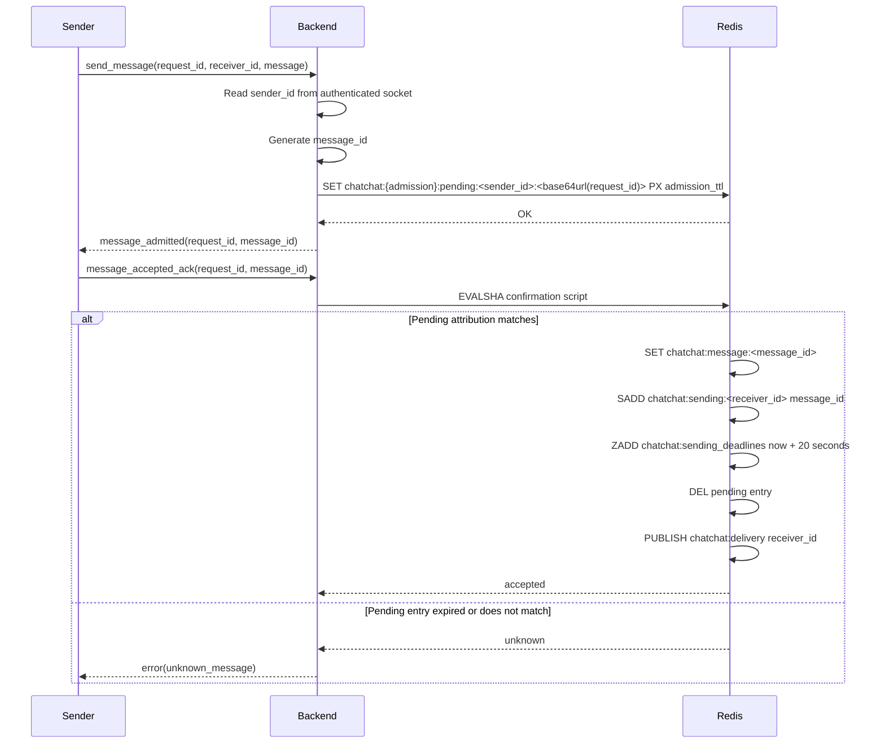
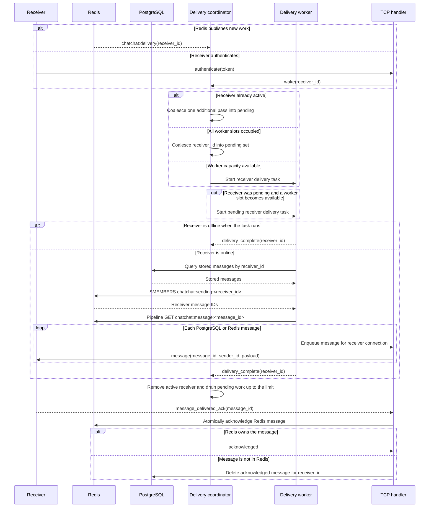
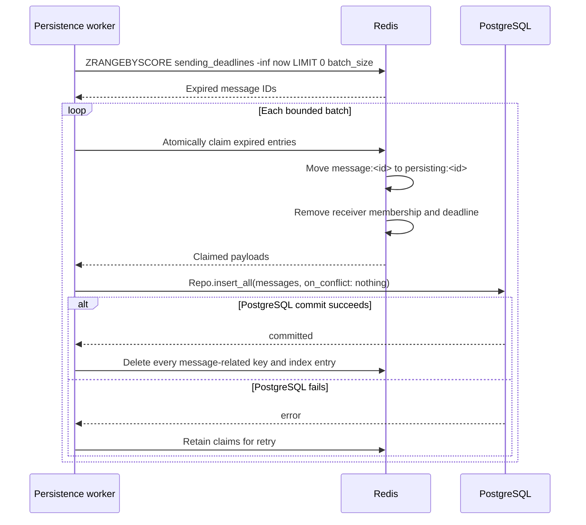

# Message delivery

Messages remain in Redis for a 20-second online-delivery window. Messages not acknowledged during that window are moved to PostgreSQL for future delivery.

## Message acceptance


```mermaid
sequenceDiagram
    participant C1 as Sender
    participant BE as Backend
    participant Redis

    C1->>BE: send_message(request_id, receiver_id, message)
    BE->>BE: Read sender_id from authenticated socket
    BE->>BE: Generate message_id
    BE->>Redis: SET chatchat:{admission}:pending:<sender_id>:<base64url(request_id)> PX admission_ttl
    Redis-->>BE: OK
    BE-->>C1: message_admitted(request_id, message_id)

    C1->>BE: message_accepted_ack(request_id, message_id)
    BE->>Redis: EVALSHA confirmation script

    alt Pending attribution matches
        Redis->>Redis: SET chatchat:message:<message_id>
        Redis->>Redis: SADD chatchat:sending:<receiver_id> message_id
        Redis->>Redis: ZADD chatchat:sending_deadlines now + 20 seconds
        Redis->>Redis: DEL pending entry
        Redis->>Redis: PUBLISH chatchat:delivery receiver_id
        Redis-->>BE: accepted
    else Pending entry expired or does not match
        Redis-->>BE: unknown
        BE-->>C1: error(unknown_message)
    end
```

The confirmation script creates these entries atomically:

```text
chatchat:message:<message_id>          -> complete admitted message
chatchat:sending:<receiver_id>         -> set of message_ids
chatchat:sending_deadlines             -> score: expires_at_ms, member: message_id
```

The pending entry remains keyed by `sender_id + request_id` because it identifies the sender's admission request. It is deleted when the message enters the sending state. Repeating the sender acknowledgement after that returns `unknown_message`.

The script is loaded at startup and called with `EVALSHA`. On `NOSCRIPT`, the backend loads it again and retries once.

## Delivery worker


```mermaid
sequenceDiagram
    participant C2 as Receiver
    participant Redis
    participant DB as PostgreSQL
    participant DC as Delivery coordinator
    participant DW as Delivery worker
    participant H as TCP handler

    alt Redis publishes new work
        Redis-->>DC: chatchat:delivery(receiver_id)
    else Receiver authenticates
        C2->>H: authenticate(token)
        H->>DC: wake(receiver_id)
    end

    alt Receiver already active
        DC->>DC: Coalesce one additional pass into pending
    else All worker slots occupied
        DC->>DC: Coalesce receiver_id into pending set
    else Worker capacity available
        DC->>DW: Start receiver delivery task
    end

    opt Receiver was pending and a worker slot becomes available
        DC->>DW: Start pending receiver delivery task
    end

    alt Receiver is offline when the task runs
        DW-->>DC: delivery_complete(receiver_id)
    else Receiver is online
        DW->>DB: Query stored messages by receiver_id
        DB-->>DW: Stored messages
        DW->>Redis: SMEMBERS chatchat:sending:<receiver_id>
        Redis-->>DW: Receiver message IDs
        DW->>Redis: Pipeline GET chatchat:message:<message_id>
        loop Each PostgreSQL or Redis message
            DW->>H: Enqueue message for receiver connection
            H->>C2: message(message_id, sender_id, payload)
        end
        DW-->>DC: delivery_complete(receiver_id)
    end

    DC->>DC: Remove active receiver and drain pending work up to the limit

    C2-->>H: message_delivered_ack(message_id)
    H->>Redis: Atomically acknowledge Redis message
    alt Redis owns the message
        Redis-->>H: acknowledged
    else Message is not in Redis
        H->>DB: Delete acknowledged message for receiver_id
    end
```

`ChatchatTcp.Delivery` is the node-local delivery coordinator. It subscribes to the Redis delivery channel, and the same `wake(receiver_id)` scheduling path handles both Pub/Sub notifications and receiver authentication.

The coordinator applies bounded concurrency before starting supervised delivery tasks. `active` contains receivers with a running task, while `pending` contains receivers waiting for a task or needing another pass after their current task finishes. Repeated wakeups for the same receiver are coalesced because both collections are sets. When a task completes, the coordinator removes its receiver from `active` and drains `pending` until the configured capacity is full again.

This bounds concurrent PostgreSQL queries and Redis pipelines during a burst. It deliberately trades some queueing latency for stable downstream resource usage. The current scheduler state is exposed as `chatchat_delivery_active_workers` and `chatchat_delivery_pending_receivers`.

Each delivery task reads only its receiver's Redis set and PostgreSQL rows; it never scans the Redis keyspace.

A successful acknowledgement sends no response to the client. It removes the message from Redis or PostgreSQL, whichever currently owns it.

## Persistence worker


```mermaid
sequenceDiagram
    participant PW as Persistence worker
    participant Redis
    participant DB as PostgreSQL

    PW->>Redis: ZRANGEBYSCORE sending_deadlines -inf now LIMIT 0 batch_size
    Redis-->>PW: Expired message IDs

    loop Each bounded batch
        PW->>Redis: Atomically claim expired entries
        Redis->>Redis: Move message:<id> to persisting:<id>
        Redis->>Redis: Remove receiver membership and deadline
        Redis-->>PW: Claimed payloads
        PW->>DB: Repo.insert_all(messages, on_conflict: nothing)

        alt PostgreSQL commit succeeds
            DB-->>PW: committed
            PW->>Redis: Delete every message-related key and index entry
        else PostgreSQL fails
            DB-->>PW: error
            PW->>Redis: Retain claims for retry
        end
    end
```

The worker never runs `SCAN`. The sorted set is the expiration index, so finding expired messages costs approximately `O(log N + batch_size)`.

Messages are handled in fixed-size batches:

1. Read expired members from `sending_deadlines`.
2. Atomically move them out of the sending state.
3. Move their payloads to recoverable `persisting:<message_id>` keys.
4. Insert the batch with `Repo.insert_all/3`.
5. Use `message_id` as a PostgreSQL unique key and `on_conflict: :nothing`.
6. Remove every Redis trace only after PostgreSQL commits.

Claims remain in `chatchat:persisting` until the database commit. If the backend crashes, the persistence worker reads this set and retries. Once persistence removes the message from the receiver set, later wakeups cannot deliver it. A delivery that fetched the payload immediately before persistence claimed it may still race and send a duplicate; clients deduplicate using the stable `message_id`.

When a query returns a full batch, the worker immediately requests another one. Otherwise, it reads the earliest deadline and schedules itself for that time instead of polling every second.

## PostgreSQL message

The stored record needs at least:

```text
message_id
sender_id
receiver_id
payload
inserted_at
```

`message_id` is unique. This makes retries safe if PostgreSQL commits but the backend crashes before cleaning Redis.
